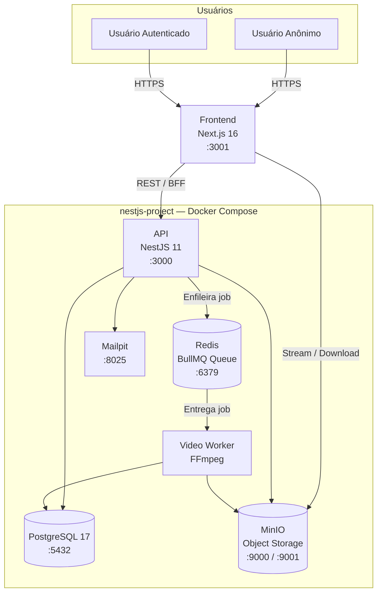
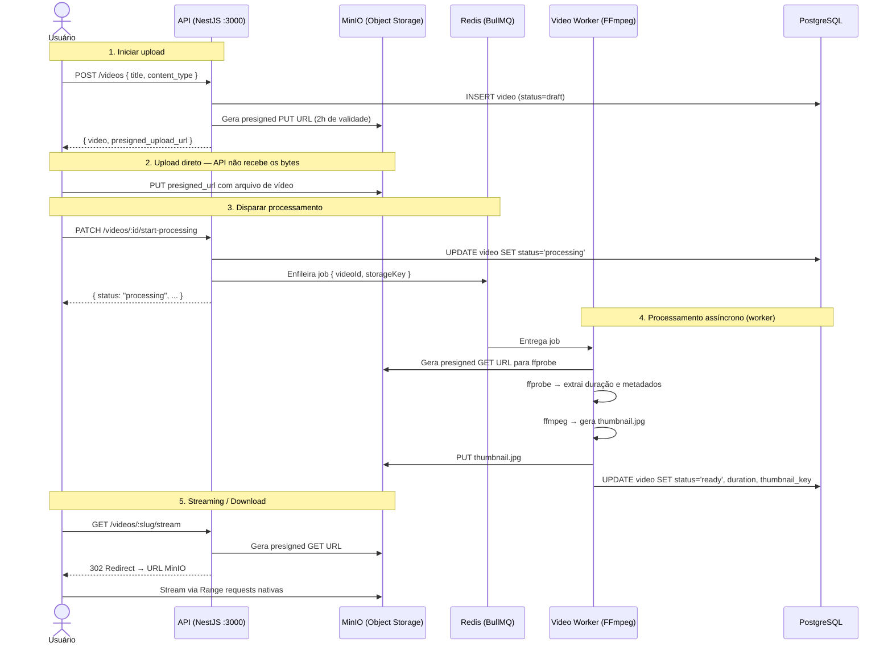
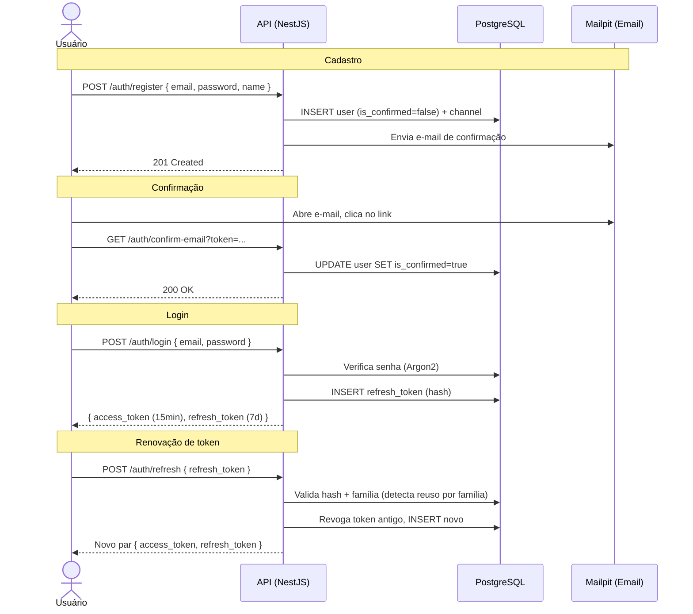

<!-- TOC -->

- [StreamTube — Plataforma de Compartilhamento de Vídeos](#streamtube--plataforma-de-compartilhamento-de-vídeos)
  - [Professor](#professor)
  - [Quadro Branco](#quadro-branco)
  - [Design System (Figma)](#design-system-figma)
  - [Pré-requisitos](#pré-requisitos)
  - [Arquitetura](#arquitetura)
  - [Como Rodar](#como-rodar)
    - [Executando com o comando make](#executando-com-o-comando-make)
    - [Executando sem o comando make](#executando-sem-o-comando-make)
      - [1. Backend (NestJS + PostgreSQL + MinIO + Redis + Mailpit)](#1-backend-nestjs--postgresql--minio--redis--mailpit)
      - [2. Frontend (Next.js)](#2-frontend-nextjs)
  - [Fluxo de Upload de Vídeo](#fluxo-de-upload-de-vídeo)
  - [Fluxo de Autenticação](#fluxo-de-autenticação)
  - [Testes](#testes)
    - [Backend (Jest)](#backend-jest)
    - [Frontend (Vitest + Playwright)](#frontend-vitest--playwright)
  - [Tutorial de Uso via API](#tutorial-de-uso-via-api)
    - [1. Criar conta](#1-criar-conta)
    - [2. Confirmar e-mail](#2-confirmar-e-mail)
    - [3. Fazer login e salvar o token](#3-fazer-login-e-salvar-o-token)
    - [4. Criar vídeo e obter URL de upload](#4-criar-vídeo-e-obter-url-de-upload)
    - [5. Fazer upload diretamente para o MinIO](#5-fazer-upload-diretamente-para-o-minio)
    - [6. Iniciar processamento](#6-iniciar-processamento)
    - [7. Consultar vídeo processado](#7-consultar-vídeo-processado)
    - [8. Publicar vídeo](#8-publicar-vídeo)
    - [9. Atualizar título do vídeo](#9-atualizar-título-do-vídeo)
    - [10. Assistir / Baixar](#10-assistir--baixar)
    - [11. Incrementar visualizações](#11-incrementar-visualizações)
    - [12. Listar e cadastrar categorias](#12-listar-e-cadastrar-categorias)
    - [13. Comentários](#13-comentários)
    - [14. Likes e dislikes do vídeo](#14-likes-e-dislikes-do-vídeo)
    - [15. Inscrições em canal](#15-inscrições-em-canal)
    - [16. Remover vídeo](#16-remover-vídeo)
  - [Funcionalidades Implementadas](#funcionalidades-implementadas)
    - [Fase 01 — Configuração Base](#fase-01--configuração-base)
    - [Fase 02 — Autenticação](#fase-02--autenticação)
    - [Fase 03 — Upload e Processamento de Vídeos](#fase-03--upload-e-processamento-de-vídeos)
    - [Fase 04 — Gerenciamento de Vídeos e Canal](#fase-04--gerenciamento-de-vídeos-e-canal)
    - [Fase 05 — Página de Visualização do Vídeo](#fase-05--página-de-visualização-do-vídeo)
    - [Fase 06 — Interações Sociais](#fase-06--interações-sociais)
    - [Fase 07 — Página Inicial, Busca e Finalização](#fase-07--página-inicial-busca-e-finalização)
  - [Estrutura do Projeto](#estrutura-do-projeto)
  - [Fases do Projeto](#fases-do-projeto)
  - [Stack Tecnológica](#stack-tecnológica)
  - [Developer](#developer)
  - [License](#license)

<!-- TOC -->

# StreamTube — Plataforma de Compartilhamento de Vídeos

Projeto da disciplina **Desenvolvimento de Aplicações de IA** do MBA de Engenharia de Software com IA da [Full Cycle](https://fullcycle.com.br).

Este é um projeto greenfield desenvolvido para demonstrar como construir uma aplicação do zero utilizando IA de forma adequada no processo de desenvolvimento.

## Professor

<a href="https://github.com/argentinaluiz">
    
    <br />
    <sub>
        <b>Luiz Carlos</b>
    </sub>
</a>

## Quadro Branco

- [Quadro Branco](./whiteboard.svg)

## Design System (Figma)

- [FC Tube.fig](./FC%20Tube.fig) — arquivo-fonte do **design system** do projeto no Figma.

Contém os fundamentos visuais do StreamTube — tokens (cores, tipografia, espaçamento, raios), componentes e as telas da plataforma. É a referência de design para a implementação do frontend: os componentes em `next-frontend/components/ui` (shadcn) e os tokens em `next-frontend/app/globals.css` derivam deste arquivo. Abra-o no Figma (`Arquivo → Importar`) para consultar especificações e estados visuais.

## Pré-requisitos

- Docker e Docker Compose
- Node.js v22+ (para rodar os testes Playwright no host)
- npm

## Arquitetura

O projeto é um monorepo baseado em containers Docker. Cada subprojeto sobe sua própria stack via `docker compose`.



- **Frontend** (Next.js 16, App Router + React Server Components) — interface da plataforma. Segue o **modelo BFF**: o navegador nunca chama a API NestJS diretamente; todo tráfego passa por Route Handlers same-origin em `app/api/**`, que fazem proxy server-side para a API.
- **API** (NestJS 11) — regras de negócio, autenticação JWT, upload de vídeos (presigned URLs), envio de e-mails e acesso ao banco.
- **Video Worker** — container separado com FFmpeg; consome jobs do BullMQ, gera thumbnails e atualiza status dos vídeos.
- **Database** (PostgreSQL 17) — usuários, canais, vídeos e tokens de autenticação.
- **Object Storage** (MinIO, S3-compatible) — arquivos de vídeo e thumbnails; clientes fazem upload diretamente via presigned PUT URLs.
- **Message Queue** (BullMQ + Redis) — fila de processamento de vídeos.
- **Email Service** (Mailpit) — captura os e-mails transacionais em uma UI local para desenvolvimento.

O diagrama de arquitetura completo (C4) está em [docs/diagrams/software-arch.mermaid](docs/diagrams/software-arch.mermaid).

## Como Rodar

### Executando com o comando make

> **INFO:** use `make help` para ver todos os comandos disponíveis via ``Makefile`` na raiz do projeto.

Configure os arquivos de variáveis de ambiente.

```bash
# Copie as variáveis de ambiente e ajuste conforme a necessidade
cp nestjs-project/.env.example nestjs-project/.env

# Copie as variáveis de ambiente
cp next-frontend/.env.example next-frontend/.env.local
```

> **Confirmação de e-mail (desenvolvimento):** o arquivo `.env.example` do backend define `REQUIRE_EMAIL_CONFIRMATION=true`, que é o padrão seguro para produção. Em desenvolvimento, o `.env` já vem com `REQUIRE_EMAIL_CONFIRMATION=false` para permitir login imediatamente após o cadastro, sem precisar confirmar o e-mail. Altere para `true` sempre que quiser testar o fluxo completo de confirmação.

O arquivo `Makefile` na raiz do projeto oferece atalhos para as tarefas mais comuns:

```bash
make help            # lista todos os comandos disponíveis

make up              # sobe todos os containers (backend + frontend)
make down            # derruba todos os containers
make install         # instala dependências em todos os containers

make test            # roda todos os testes (backend + E2E + frontend)
make test-backend    # testes unitários e de integração do NestJS
make test-e2e        # testes E2E do NestJS (supertest)
make test-frontend   # testes Vitest do Next.js

make lint            # lint em ambos os subprojetos
make typecheck       # type-check TypeScript em ambos

make migrate         # executa migrações pendentes do banco
make seed            # insere dados de exemplo no banco
```

Veja os links de acesso a aplicação na seção a seguir.

### Executando sem o comando make

Os dois subprojetos têm stacks Docker **separadas**. O backend deve estar rodando antes do frontend.

#### 1. Backend (NestJS + PostgreSQL + MinIO + Redis + Mailpit)

```bash
cd nestjs-project

# Copie as variáveis de ambiente
cp .env.example .env

# Sobe todos os serviços (API, banco, MinIO, Redis, Mailpit, video-worker)
docker compose up -d

# Instala dependências dentro do container (apenas na primeira vez)
docker compose exec nestjs-api npm install

# Cria o schema do banco (obrigatório — synchronize está desabilitado)
docker compose exec nestjs-api npm run migration:run

# Inicia o servidor de desenvolvimento em watch mode
docker compose exec -d nestjs-api npm run start:dev

# O video-worker já sobe automaticamente via compose.
# Para acompanhar seus logs:
docker compose logs -f video-worker
```

Serviços disponíveis após o boot:

| Serviço | URL / Porta | Credenciais |
|---------|-------------|-------------|
| API NestJS | http://localhost:3000 | — |
| Swagger (OpenAPI) | http://localhost:3000/api-docs | habilite com `SWAGGER_ENABLED=true` |
| PostgreSQL | `localhost:5432` | usuário/senha/db: `streamtube` |
| MinIO (API S3) | http://localhost:9000 | — |
| MinIO (Console UI) | http://localhost:9001 | usuário: `streamtube`, senha: `streamtube` |
| Redis | `localhost:6379` | — |
| Mailpit (UI de e-mails) | http://localhost:8025 | — |

#### 2. Frontend (Next.js)

```bash
cd next-frontend

# Copie as variáveis de ambiente
cp .env.example .env.local

docker compose up -d
docker compose exec next-frontend npm install        # apenas na primeira vez
docker compose exec -d next-frontend npm run dev
```

A aplicação ficará disponível em **http://localhost:3001**.

> As stacks são separadas: o frontend acessa o backend via `host.docker.internal:3000` (configurado em `.env.local` e no `extra_hosts` do compose).

## Fluxo de Upload de Vídeo

O upload segue uma estratégia de **presigned URL** — o arquivo vai direto do browser para o MinIO, sem passar pela API NestJS, suportando arquivos de qualquer tamanho.



## Fluxo de Autenticação



## Testes

### Backend (Jest)

```bash
cd nestjs-project

# Unitários + integração (banco real e MinIO real)
docker compose exec nestjs-api npm test -- --runInBand

# Apenas testes de integração
docker compose exec nestjs-api npm run test:integration

# End-to-end — --runInBand já configurado no package.json
docker compose exec nestjs-api npm run test:e2e

# Cobertura de código
docker compose exec nestjs-api npm run test:cov

# Type-check (obrigatório antes de qualquer commit)
docker compose exec nestjs-api npx tsc --noEmit

# Lint com auto-fix
docker compose exec nestjs-api npm run lint
```

Sufixos de arquivos de teste:

| Sufixo | Tipo | Banco real | Localização |
|--------|------|-----------|-------------|
| `*.spec.ts` | Unitário — toda dependência mockada | Não | Ao lado do source |
| `*.integration-spec.ts` | Integração — módulos e banco reais | Sim | Ao lado do source |
| `*.e2e-spec.ts` | End-to-end — ciclo HTTP completo via supertest | Sim | `nestjs-project/test/` |

> Testes de integração e e2e **sempre rodam com `--runInBand`** — execução paralela causa violações de FK ao compartilhar o banco de testes.

### Frontend (Vitest + Playwright)

```bash
cd next-frontend

# Unitários + integração (Vitest + MSW)
docker compose exec next-frontend npm test

# End-to-end (Playwright, executa no host)
npx playwright test
```

Sufixos: `*.test.ts(x)` (unitário), `*.integration.test.ts(x)` (Route Handlers com MSW), `*.e2e-spec.ts` (Playwright). MSW intercepta chamadas à API NestJS — os testes nunca batem no backend real.

## Tutorial de Uso via API

Passo a passo para usar a plataforma com a API em execução. Use o **Swagger** em http://localhost:3000/api-docs ou `curl` conforme preferir.

### 1. Criar conta

```bash
curl -s -X POST http://localhost:3000/auth/register \
  -H "Content-Type: application/json" \
  -d '{"name":"Seu Nome","email":"voce@example.com","password":"Senha@123"}'
```

### 2. Confirmar e-mail

Abra **http://localhost:8025** (Mailpit), localize o e-mail de confirmação e clique no link. Ou copie o token do link e confirme via API:

```bash
curl -s "http://localhost:3000/auth/confirm-email?token=<TOKEN>"
```

### 3. Fazer login e salvar o token

```bash
TOKEN=$(curl -s -X POST http://localhost:3000/auth/login \
  -H "Content-Type: application/json" \
  -d '{"email":"voce@example.com","password":"Senha@123"}' \
  | jq -r '.access_token')

echo "Access token: $TOKEN"
```

### 4. Criar vídeo e obter URL de upload

```bash
RESPONSE=$(curl -s -X POST http://localhost:3000/videos \
  -H "Authorization: Bearer $TOKEN" \
  -H "Content-Type: application/json" \
  -d '{"title":"Meu Primeiro Vídeo","content_type":"video/mp4"}')

VIDEO_ID=$(echo $RESPONSE | jq -r '.video.id')
SLUG=$(echo $RESPONSE | jq -r '.video.slug')
UPLOAD_URL=$(echo $RESPONSE | jq -r '.presigned_upload_url')

echo "Video ID: $VIDEO_ID  |  Slug: $SLUG"
```

### 5. Fazer upload diretamente para o MinIO

```bash
curl -s -X PUT "$UPLOAD_URL" \
  -H "Content-Type: video/mp4" \
  --upload-file /caminho/para/seu/video.mp4
```

> O arquivo vai direto para o MinIO — a API NestJS não processa nem armazena os bytes.

### 6. Iniciar processamento

```bash
curl -s -X PATCH "http://localhost:3000/videos/$VIDEO_ID/start-processing" \
  -H "Authorization: Bearer $TOKEN"
# Resposta: { status: "processing", ... }
```

Acompanhe o worker processar o vídeo:

```bash
docker compose logs -f video-worker
```

### 7. Consultar vídeo processado

```bash
# Listar todos os vídeos com status ready
curl -s http://localhost:3000/videos | jq .

# Buscar por slug
curl -s "http://localhost:3000/videos/$SLUG" | jq .
# status="ready", duration preenchido, thumbnail_key disponível
```

### 8. Publicar vídeo

Após o processamento o vídeo fica com status `ready`. Para aparecer nos resultados públicos de listagem e busca, ele precisa ser publicado.

```bash
curl -s -X PATCH "http://localhost:3000/videos/$VIDEO_ID/publish" \
  -H "Authorization: Bearer $TOKEN" | jq .
# Resposta: { published_at: "2024-...", visibility: "public", ... }
```

### 9. Atualizar título do vídeo

```bash
curl -s -X PATCH "http://localhost:3000/videos/$VIDEO_ID" \
  -H "Authorization: Bearer $TOKEN" \
  -H "Content-Type: application/json" \
  -d '{"title":"Meu Vídeo Atualizado","description":"Nova descrição do vídeo"}' | jq .
```

### 10. Assistir / Baixar

```bash
# Streaming: 302 → URL MinIO com suporte a Range requests
curl -s -I "http://localhost:3000/videos/$SLUG/stream"
# Location: https://... (abra no browser para assistir)

# Download com content-disposition: attachment
curl -s -I "http://localhost:3000/videos/$SLUG/download"

# Thumbnail (redireciona para a imagem gerada pelo FFmpeg)
curl -s -I "http://localhost:3000/videos/$SLUG/thumbnail"
```

### 11. Incrementar visualizações

Chamado automaticamente pelo player ao montar na página `/watch/{slug}`. Também pode ser acionado diretamente:

```bash
curl -s -X POST "http://localhost:3000/videos/$SLUG/views" | jq .
# { view_count: 1 }

# Verificar contador atualizado
curl -s "http://localhost:3000/videos/$SLUG" | jq '.view_count'
```

### 12. Listar e cadastrar categorias

```bash
# Listar todas as categorias disponíveis
CATEGORIES=$(curl -s "http://localhost:3000/categories")
echo $CATEGORIES | jq .

# Salvar o ID de uma categoria
CATEGORY_ID=$(echo $CATEGORIES | jq -r '.[0].id')
echo "Category ID: $CATEGORY_ID"

# Atribuir categoria ao vídeo
curl -s -X PATCH "http://localhost:3000/videos/$VIDEO_ID" \
  -H "Authorization: Bearer $TOKEN" \
  -H "Content-Type: application/json" \
  -d "{\"category_id\":\"$CATEGORY_ID\"}" | jq .

# Listar vídeos filtrados por categoria
curl -s "http://localhost:3000/videos?category_id=$CATEGORY_ID" | jq .
```

### 13. Comentários

```bash
# Listar comentários paginados do vídeo (públic, sem autenticação)
curl -s "http://localhost:3000/videos/$SLUG/comments" | jq .

# Criar comentário
COMMENT=$(curl -s -X POST "http://localhost:3000/videos/$SLUG/comments" \
  -H "Authorization: Bearer $TOKEN" \
  -H "Content-Type: application/json" \
  -d '{"content":"Ótimo vídeo!"}')
echo $COMMENT | jq .
COMMENT_ID=$(echo $COMMENT | jq -r '.id')

# Responder a um comentário (max depth 1)
curl -s -X POST "http://localhost:3000/comments/$COMMENT_ID/replies" \
  -H "Authorization: Bearer $TOKEN" \
  -H "Content-Type: application/json" \
  -d '{"content":"Obrigado pelo comentário!"}' | jq .

# Deletar próprio comentário
curl -s -X DELETE "http://localhost:3000/comments/$COMMENT_ID" \
  -H "Authorization: Bearer $TOKEN"
# 204 No Content
```

### 14. Likes e dislikes do vídeo

```bash
# Dar like no vídeo
curl -s -X POST "http://localhost:3000/videos/$SLUG/likes" \
  -H "Authorization: Bearer $TOKEN" \
  -H "Content-Type: application/json" \
  -d '{"type":"like"}' | jq .

# Mudar para dislike (chamar novamente com "dislike" — toggle se mesmo tipo)
curl -s -X POST "http://localhost:3000/videos/$SLUG/likes" \
  -H "Authorization: Bearer $TOKEN" \
  -H "Content-Type: application/json" \
  -d '{"type":"dislike"}' | jq .

# Remover voto
curl -s -X DELETE "http://localhost:3000/videos/$SLUG/likes" \
  -H "Authorization: Bearer $TOKEN"
# 204 No Content

# Ver contadores atuais no detalhe do vídeo
curl -s "http://localhost:3000/videos/$SLUG" | jq '{like_count, dislike_count}'
```

### 15. Inscrições em canal

O nickname do canal é derivado do prefixo do e-mail de cadastro (ex.: `voce@example.com` → `voce`). Ajuste conforme o canal desejado.

```bash
CHANNEL_NICKNAME="voce"   # substitua pelo nickname do canal alvo

# Inscrever-se em um canal
curl -s -X POST "http://localhost:3000/channels/$CHANNEL_NICKNAME/subscriptions" \
  -H "Authorization: Bearer $TOKEN" | jq .

# Listar canais em que o usuário está inscrito
curl -s "http://localhost:3000/users/me/subscriptions" \
  -H "Authorization: Bearer $TOKEN" | jq .

# Cancelar inscrição
curl -s -X DELETE "http://localhost:3000/channels/$CHANNEL_NICKNAME/subscriptions" \
  -H "Authorization: Bearer $TOKEN"
# 204 No Content
```

### 16. Remover vídeo

```bash
curl -s -X DELETE "http://localhost:3000/videos/$VIDEO_ID" \
  -H "Authorization: Bearer $TOKEN"
# 204 No Content — arquivo removido do MinIO e registro deletado do banco
```

## Funcionalidades Implementadas

### Fase 01 — Configuração Base

Infraestrutura base: NestJS 11 com TypeORM, PostgreSQL 17, Docker Compose, ESLint/Prettier, migrations, validação de variáveis de ambiente via Joi.

### Fase 02 — Autenticação

Fluxo completo de **cadastro → confirmação por e-mail → login → recuperação de senha**, com canal criado automaticamente para cada usuário.

Endpoints da API:

| Método & Rota | Auth | Descrição |
|---------------|------|-----------|
| `POST /auth/register` | Público | Cadastro de usuário (cria usuário + canal) |
| `GET /auth/confirm-email?token=` | Público | Confirmação de conta via link do e-mail |
| `POST /auth/resend-confirmation` | Público | Reenvio do e-mail de confirmação |
| `POST /auth/login` | Público | Login (retorna access + refresh token) |
| `POST /auth/refresh` | Público | Rotação de refresh token (detecção de reuso por família) |
| `POST /auth/logout` | Bearer JWT | Revoga os refresh tokens da sessão |
| `POST /auth/forgot-password` | Público | Solicita e-mail de recuperação de senha |
| `POST /auth/reset-password` | Público | Redefine a senha via token |
| `GET /auth/me` | Bearer JWT | Dados do usuário autenticado |

Segurança: senhas com **Argon2**, **JWT** com `JwtAuthGuard` global (opt-out via `@Public()`), **rotação de refresh token** com detecção de reuso por família, **rate limiting** (`ThrottlerGuard`) nos endpoints de auth, sessão no browser via **iron-session** (cookies HTTP-only).

Telas no frontend: `/(auth)/signup`, `/(auth)/login`, `/(auth)/forgot-password` com React Hook Form + Zod.

### Fase 03 — Upload e Processamento de Vídeos

Endpoints da API:

| Método & Rota | Auth | Descrição |
|---------------|------|-----------|
| `POST /videos` | Bearer JWT | Cria rascunho e retorna URL de upload presigned |
| `PATCH /videos/:id/start-processing` | Bearer JWT | Inicia processamento (enfileira job BullMQ) |
| `GET /videos` | Público | Lista paginada de vídeos com status `ready` |
| `GET /videos/:slug` | Público | Detalhe de vídeo por slug único |
| `GET /videos/:slug/stream` | Público | Redirect 302 → presigned GET URL MinIO (Range nativo) |
| `GET /videos/:slug/download` | Público | Redirect 302 com `content-disposition: attachment` |
| `DELETE /videos/:id` | Bearer JWT | Remove vídeo e arquivos do MinIO |

Ciclo de vida do vídeo: `draft → processing → ready | error`.

### Fase 04 — Gerenciamento de Vídeos e Canal

Categorias de vídeo, edição, visibilidade, thumbnail customizada, publicação, páginas públicas de canal e gerenciamento de categorias.

| Método & Rota | Auth | Descrição |
|---------------|------|-----------|
| `GET /categories` | Público | Lista categorias disponíveis |
| `POST /categories` | Bearer JWT | Cria categoria (slug auto-gerado a partir do nome) |
| `GET /categories/:id` | Público | Retorna categoria por id |
| `PATCH /categories/:id` | Bearer JWT | Atualiza nome e slug da categoria |
| `DELETE /categories/:id` | Bearer JWT | Remove categoria; vídeos ficam sem categoria (FK SET NULL) |
| `PATCH /videos/:id` | Bearer JWT | Editar título, descrição, categoria e visibilidade |
| `POST /videos/:id/thumbnail` | Bearer JWT | Presigned URL para upload de thumbnail customizada |
| `GET /videos/:slug/thumbnail` | Público | Redireciona 302 para URL presigned da thumbnail |
| `PATCH /videos/:id/publish` | Bearer JWT | Publicar vídeo (transita para status `ready`) |
| `GET /videos` | Público | Filtragem por `category_id` e `channel_id`; somente vídeos públicos e prontos |
| `GET /channels/:nickname` | Público | Página pública do canal com estatísticas |
| `GET /channels/:nickname/videos` | Público | Vídeos publicados do canal |
| `PATCH /channels/:nickname` | Bearer JWT | Editar nome e descrição do próprio canal |
| `GET /channels/:nickname/studio/videos` | Bearer JWT | Painel studio — todos os vídeos do canal |

### Fase 05 — Página de Visualização do Vídeo

Player nativo HTML5, contagem de visualizações e sugestões por categoria.

| Método & Rota | Auth | Descrição |
|---------------|------|-----------|
| `POST /videos/:slug/views` | Público | Incrementar contador de visualizações (atômico) |
| `GET /videos/:slug/suggestions` | Público | Até 10 vídeos da mesma categoria por `view_count DESC` |

### Fase 06 — Interações Sociais

Likes/dislikes em vídeos e comentários, comentários com respostas (max depth 1), inscrições em canais, contadores atômicos.

| Método & Rota | Auth | Descrição |
|---------------|------|-----------|
| `POST /videos/:slug/likes` | Bearer JWT | Like ou dislike em vídeo (toggle se mesmo tipo) |
| `DELETE /videos/:slug/likes` | Bearer JWT | Remover voto de vídeo |
| `GET /videos/:slug/comments` | Público | Comentários paginados com respostas (max depth 1) |
| `POST /videos/:slug/comments` | Bearer JWT | Criar comentário |
| `POST /comments/:id/replies` | Bearer JWT | Responder a um comentário |
| `DELETE /comments/:id` | Bearer JWT | Deletar próprio comentário |
| `POST /comments/:id/likes` | Bearer JWT | Like ou dislike em comentário |
| `DELETE /comments/:id/likes` | Bearer JWT | Remover voto de comentário |
| `POST /channels/:nickname/subscriptions` | Bearer JWT | Inscrever-se em canal |
| `DELETE /channels/:nickname/subscriptions` | Bearer JWT | Cancelar inscrição |
| `GET /users/me/subscriptions` | Bearer JWT | Listar canais seguidos |

### Fase 07 — Página Inicial, Busca e Finalização

Busca por texto livre (ILIKE no título e nome do canal), página inicial com grid de vídeos, header com busca, layout responsivo.

| Método & Rota | Auth | Descrição |
|---------------|------|-----------|
| `GET /videos?q=<texto>` | Público | Busca por título (ILIKE) ou nome de canal; ordenado por `view_count DESC` |

## Estrutura do Projeto

```
mba-ia-greenfield-project/
├── docs/
│   ├── project-plan.md                   # Planejamento geral do projeto
│   ├── decisions/                        # Decisões técnicas por fase (TD-NN)
│   │   ├── technical-decisions-phase-01-configuracao-base.md
│   │   ├── technical-decisions-phase-02-auth.md
│   │   ├── technical-decisions-phase-02-auth-frontend.md
│   │   ├── technical-decisions-phase-03-videos.md
│   │   ├── technical-decisions-phase-04-video-management.md
│   │   ├── technical-decisions-phase-05-video-watch.md
│   │   ├── technical-decisions-phase-06-social.md
│   │   └── technical-decisions-phase-07-home-search.md
│   ├── phases/                           # Planos de implementação por fase
│   │   ├── phase-01-configuracao-base/
│   │   ├── phase-02-auth/
│   │   ├── phase-02-auth-frontend/
│   │   ├── phase-03-videos/              # context, phase plan, validation, library-refs, progress
│   │   ├── phase-04-video-management/    # categories, visibility, publish, channel admin
│   │   ├── phase-05-video-watch/         # HTML5 player, view count, suggestions
│   │   ├── phase-06-social/              # likes, comments, subscriptions
│   │   └── phase-07-home-search/         # home page, search, header, responsive, deploy
│   └── diagrams/
│       └── software-arch.mermaid         # Diagrama de arquitetura (C4)
│
├── nestjs-project/                       # Backend API (NestJS 11)
│   ├── src/
│   │   ├── app.module.ts                 # Módulo raiz
│   │   ├── main.ts                       # Bootstrap HTTP server
│   │   ├── worker.ts                     # Bootstrap video worker (sem HTTP)
│   │   ├── worker.module.ts              # Módulo do worker
│   │   ├── auth/                         # Cadastro, login, JWT, refresh, reset de senha
│   │   ├── users/                        # Entidade e serviço de usuários
│   │   ├── channels/                     # Canal 1:1 por usuário
│   │   ├── videos/                       # Upload, processamento e streaming
│   │   │   ├── entities/video.entity.ts  # Entidade Video + enum VideoStatus
│   │   │   ├── dto/                      # CreateVideoDto, QueryVideosDto
│   │   │   ├── processors/               # VideoProcessingProcessor (BullMQ + FFmpeg)
│   │   │   ├── videos.service.ts         # 7 métodos de negócio
│   │   │   ├── videos.controller.ts      # 7 endpoints REST
│   │   │   └── videos.module.ts
│   │   ├── storage/                      # MinIO / S3-compatible object storage
│   │   │   ├── storage.service.ts        # Presigned URLs, putObject, deleteObject
│   │   │   └── storage.module.ts
│   │   ├── queue/                        # BullMQ + Redis
│   │   │   ├── queue.constants.ts        # VIDEO_PROCESSING_QUEUE
│   │   │   └── queue.module.ts
│   │   ├── mail/                         # Nodemailer + templates Handlebars
│   │   ├── common/                       # Filtros globais, exceptions de domínio
│   │   ├── config/                       # Configs namespaced (Joi validation)
│   │   └── database/                     # data-source, migrations, seeds
│   ├── test/                             # Testes e2e (*.e2e-spec.ts)
│   │   ├── auth.e2e-spec.ts
│   │   ├── videos.e2e-spec.ts
│   │   └── social.e2e-spec.ts            # (Fase 06)
│   ├── compose.yaml                      # Docker Compose (API + DB + MinIO + Redis + Worker + Mailpit)
│   ├── Dockerfile.dev                    # Node 22 + FFmpeg + curl
│   └── .env.example                      # Template de variáveis de ambiente
│
├── next-frontend/                        # Frontend (Next.js 16, App Router)
│   ├── app/                              # Rotas, layouts, páginas e Route Handlers BFF
│   │   ├── (auth)/                       # signup, login, forgot-password
│   │   ├── watch/[slug]/                 # Página de assistir (Fase 05)
│   │   ├── channel/[nickname]/           # Página pública do canal (Fase 04)
│   │   ├── studio/videos/                # Gerenciamento de vídeos (Fase 04)
│   │   ├── studio/categories/            # CRUD de categorias (list, new, [id])
│   │   ├── search/                       # Resultados de busca (Fase 07)
│   │   ├── subscriptions/                # Canais seguidos (Fase 06)
│   │   └── api/                          # Route Handlers BFF — proxy → API NestJS
│   ├── components/                       # auth, categories, video, social, home, layout, ui (shadcn)
│   ├── lib/                              # env, api (openapi-fetch), auth/session
│   ├── mocks/                            # MSW handlers + server (testes sem backend real)
│   ├── hooks/                            # React hooks compartilhados
│   ├── tests/                            # Testes e2e (Playwright)
│   ├── compose.yaml                      # Docker Compose (dev server Next.js :3001)
│   └── Dockerfile.dev
│
├── CHANGELOG.md                          # Histórico de mudanças por fase
├── CLAUDE.md                             # Instruções para IA (Claude Code)
├── Makefile                              # Atalhos para dev (install, up, test, lint)
├── FC Tube.fig                           # Design system do projeto (Figma)
├── whiteboard.svg                        # Quadro branco do projeto
└── README.md
```

## Fases do Projeto

| Fase | Descrição | Status |
|------|-----------|--------|
| **01** | Configuração Base do Projeto | ✅ Concluída |
| **02** | Cadastro, Login e Gerenciamento de Conta | ✅ Concluída |
| **03** | Upload e Processamento de Vídeos | ✅ Concluída |
| **04** | Gerenciamento de Vídeos e Canal | ✅ Concluída |
| **05** | Página de Visualização do Vídeo | ✅ Concluída |
| **06** | Interações Sociais (Likes, Comentários, Inscrições) | ✅ Concluída |
| **07** | Página Inicial, Busca e Finalização | ✅ Concluída |

Detalhes completos em [docs/project-plan.md](docs/project-plan.md).

## Stack Tecnológica

| Camada | Tecnologia |
|--------|------------|
| Frontend | Next.js 16, React 19, TypeScript, Tailwind CSS 4, shadcn/ui, React Hook Form + Zod, iron-session, openapi-fetch |
| Backend | NestJS 11, TypeScript, TypeORM, JWT (access + refresh), Argon2, Nodemailer + Handlebars |
| Vídeos | BullMQ + Redis, FFmpeg (fluent-ffmpeg), nanoid (slugs únicos) |
| Object Storage | MinIO (S3-compatible), AWS SDK v3, presigned URLs |
| Banco de Dados | PostgreSQL 17 |
| E-mail (dev) | Mailpit |
| Containerização | Docker, Docker Compose |
| Testes | Jest, Supertest (backend); Vitest, MSW, Playwright (frontend) |
| Qualidade | ESLint, Prettier, TypeScript strict mode |

## Developer

Aecio dos Santos Pires
- Linkedin: https://www.linkedin.com/in/aeciopires/
- Site: http://aeciopires.com/

## License

MIT License
